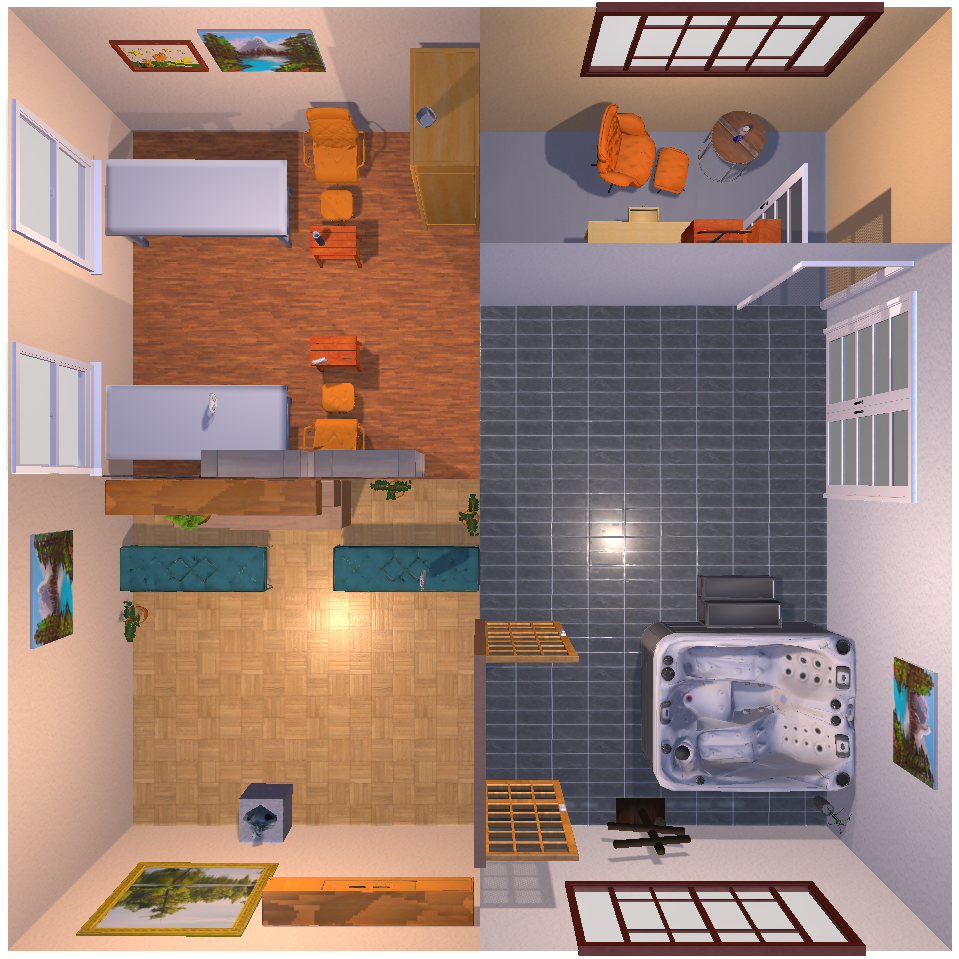

# sisglib

**Spatial Intelligence Scene Generation Library**

A unified framework for developing, evaluating, and benchmarking **compositional 3D scene generation algorithms** - built for research and production.

**For researchers:**
The *OpenAI Gym* of 3D scene generation - a standardized framework for implementing novel approaches, comparing methods, and sharing reproducible results.

**For engineers:**
The *Hugging Face Transformers* of 3D scene generation - a modular foundation for deploying research prototypes into real-world pipelines.

> **Why compositional?** sisglib focuses on asset-based scene generation for workflow compatibility with architecture and gaming, asset reusability, implicit interpretability, and platform-agnostic interoperability. [Learn more →](docs/compositional-scene-generation.md)

## Why sisglib?

Building 3D scene generation systems typically means reimplementing basic infrastructure for each new approach - asset storage, semantic search, spatial reasoning, and evaluation. **sisglib** provides a common foundation so you can focus on what's novel about your method.

**Common Interface, Custom Algorithms:**
Implement your scene generation logic once using the `SceneGenerationStrategy` interface. Compare it against other methods without reimplementing evaluation infrastructure.

**Composable by Design:**
Build strategies from reusable stages. Mix your custom architecture generator with existing object selection and spatial solvers - or vice versa.

**Backend Agnostic:**
Develop with local files and in-memory vectors. Scale to production with S3 and Pinecone. Same code, different configuration.

**Interoperable:**
Built on [sissf](https://github.com/3D-Intelligence/sissf) (Spatial Intelligence Scene State Format) standard - share intermediate results between strategies and benchmark on standardized datasets.


## What You Can Build

- **Novel Scene Generation Methods**:
Implement LLM-based, learned, or rule-based approaches within a common framework
- **Multi-Strategy Benchmarks**:
Compare your approach against baselines (e.g. Holodeck) on standardized datasets
- **Composable Pipelines**:
Mix custom stages with pre-built components - architecture generation, constraint-based placement, semantic retrieval
- **Research Prototypes**:
Rapidly test ideas with swappable components and mock-friendly architecture
- **Production Deployments**:
Take research code to production by swapping backends via configuration


## Quick Start

Generate a 3D scene from a text prompt using the pre-configured Holodeck strategy:

```python
from sissf import SceneState  # pip install sissf
from sisglib.pipeline.generation import HolodeckStrategy, SceneGenerationPipeline


# 1. Initialize holodeck strategy
holodeck_strategy = HolodeckStrategy.build()

# 2. Initialize pipeline with holodeck strategy
pipeline = SceneGenerationPipeline(strategy=holodeck_strategy)

# 3. Generate scene from prompt
scene: SceneState = await pipeline.generate(
    prompt="A spa with large hot tub, massage tables, waiting area, and office."
)
```
Output:
<!--  -->

<br>

See the full quickstart script [here](sisglib/pipeline/generation/quickstart.py).


## Developing Custom Strategies

Create custom scene generation strategies by composing reusable stages.
Mix your novel algorithms with existing components or build entirely new approaches.

### Quick Example

```python
# Mix custom stages with existing components
strategy = (
    SceneGenerationStrategy.builder()
    .with_name("Custom Hybrid Strategy")
    .add_stage(MyCustomArchitectureStage())      # Your novel architecture method
    .add_stage(HolodeckObjectSelectionStage())   # Reuse existing object selection
    .add_stage(MyCustomSpatialSolver())          # Your novel spatial reasoning
    .build()
)

pipeline = SceneGenerationPipeline(strategy=strategy)
scene = await pipeline.generate(prompt="A modern bedroom with bedside table")
```

All strategies operate on the [sissf](https://github.com/3D-Intelligence/sissf/wiki) standard, enabling mix-and-match composition, shared intermediate results, and standardized benchmarking.

**Learn more:**
- [Custom Strategies Development Guide](docs/guides/pipelines/custom-strategies.md) - Complete guide with examples
- [Semantic Asset Intelligence](docs/guides/vectors/semantic-asset-intelligence.md) - Find 3D assets using natural language or visual queries
- [`HolodeckStrategy`](sisglib/pipeline/generation/strategies/holodeck/holodeck.py) - Reference implementation

## Key Features

### Research-First Design
- **Unified Interface**: Implement once, benchmark against other methods easily
- **Composable Stages**: Mix custom and pre-built components without friction
- **Standardized Format**: [sissf](https://github.com/3D-Intelligence/sissf/wiki) ensures interoperability between strategies
- **Rapid Prototyping**: Swap backends and components via configuration
- **Mock-Friendly**: Clean interfaces and dependency injection for testing
- **Hugging Face Integration**: Stream datasets and embeddings without downloads

### Asset Management
- **Multi-Modal Search**: Find assets using text, image, or vector queries
- **Lazy Loading**: Process massive datasets over HTTP without local storage
- **Batch Processing**: Generate and store embeddings for large asset libraries
- **Flexible Metadata**: Associate arbitrary metadata with assets for filtering

## Example: Comparing Scene Generation Methods

```python
# Baseline - Holodeck
holodeck = HolodeckStrategy.build()

# Your method - custom learned placement
your_method = (
    SceneGenerationStrategy.builder()
    .add_stage(HolodeckArchitectureStage())
    .add_stage(YourLearnedPlacementStage())
    .build()
)

# Hybrid - mix both approaches
hybrid = (
    SceneGenerationStrategy.builder()
    .add_stage(YourArchitectureStage())
    .add_stage(HolodeckObjectSelectionStage())
    .add_stage(YourSpatialSolverStage())
    .build()
)

# Evaluate all three on the same dataset
for strategy in [holodeck, your_method, hybrid]:
    pipeline = SceneGenerationPipeline(strategy=strategy)
    for prompt in benchmark_prompts:
        scene = await pipeline.generate(prompt=prompt)
        metrics = evaluate_scene(scene, ground_truth)
```

## Research to Production

sisglib is designed for the full lifecycle - from initial experiments to deployed systems:

**1. Prototype Locally**
```python
# Use in-memory storage and numpy vectors
storage = await StorageAdapter.from_url("file:///local/assets")
vectors = NumpyAdapter(dimension=768)
```

**2. Validate at Scale**
```python
# Use Hugging Face datasets and local ChromaDB
storage = await StorageAdapter.from_url("https://huggingface.co/datasets/...")
vectors = ChromaDBAdapter(path="./chromadb")
```

**3. Deploy to Production**
```python
# Use cloud storage and managed vector DB
storage = await StorageAdapter.from_url("s3://prod-bucket/assets")
vectors = PineconeAdapter(api_key=os.getenv("PINECONE_KEY"))
```

Same research code. Different configuration. No refactoring.

## Documentation

### Overview
- [Project Vision](docs/vision.md)
- [Value Propositions](docs/value_propositions.md)
- [Development Roadmap](docs/roadmap.md)
- **[Why Compositional Scene Generation?](docs/compositional-scene-generation.md)** - Understanding asset-based approaches vs neural/unified methods

### Guides
- **[Custom Strategies Development Guide](docs/guides/pipelines/custom-strategies.md)** - Build your own scene generation strategies
- **[Adapter Architecture Guide](docs/guides/adapters/adapter-architecture.md)** - Understanding storage, vectors, and metadata adapters
- **[Semantic Asset Intelligence](docs/guides/adapters/vectors/semantic-asset-intelligence.md)** - Find 3D assets using natural language or visual queries
<!-- - **[Backend Configuration Guide](docs/guides/backend-configuration.md)** - Configure adapters for different environments -->
- **[HuggingFace Integration Guide](docs/guides/adapters/storage/huggingface-integration.md)** - Stream datasets without downloads

### Code Reference
- **[Holodeck Strategy](sisglib/pipeline/generation/strategies/holodeck/holodeck.py)** - Complete reference implementation
- **[Pipeline Stages](sisglib/pipeline/generation/core/stage.py)** - Stage interface and composition
- **[Scene State Format (sissf)](https://github.com/3D-Intelligence/sissf/wiki)** - Standard for scene representation
- **[Storage Adapters](sisglib/adapters/storage/base.py)** - Backend-agnostic file operations
- **[Vector Adapters](sisglib/adapters/vectors/base.py)** - Unified semantic search
- **[Metadata Adapters](sisglib/adapters/metadata/base.py)** - Consistent metadata management

## Contributing

sisglib is open-source and built for the research community. Contributions are welcome:

- **Strategy Implementations**: Share your scene generation methods
- **Pipeline Stages**: Contribute reusable components
- **Adapter Backends**: Add support for new storage/vector/metadata systems
- **Benchmarks**: Submit standardized evaluation datasets
- **Documentation**: Improve examples and guides

## Get Started

```bash
pip install sisglib  # Coming soon
```

---

**Documentation:** [coming soon]  
**License:** [MIT/Apache 2.0]
