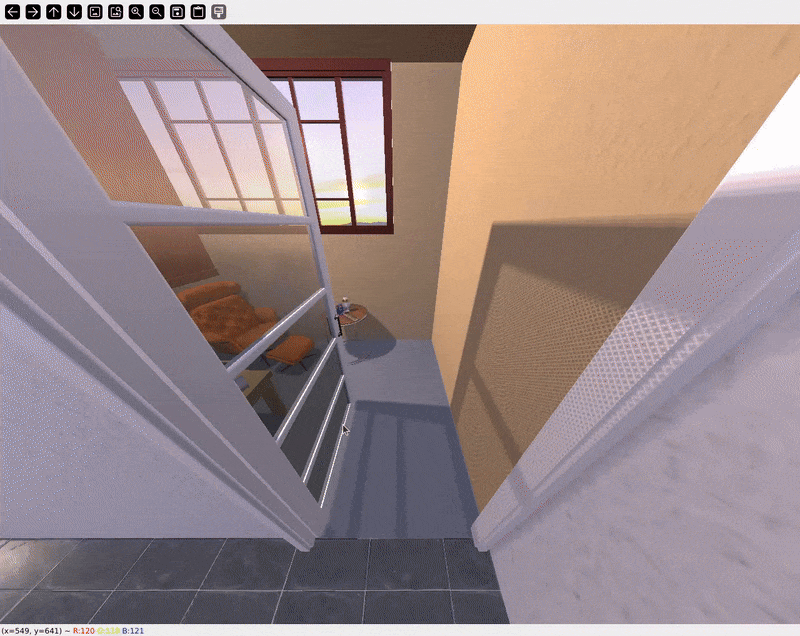

# Compositional 3D Scene Generation

## Overview

sisglib is designed specifically for **compositional (asset-based) 3D indoor scene generation** - constructing scenes by selecting, placing, and arranging discrete 3D assets rather than generating scenes as unified representations.

This document explains what compositional scene generation is, how it differs from other approaches, and why it's the preferred paradigm for many real-world applications.

## What is Compositional Scene Generation?

Compositional scene generation creates 3D scenes by:

1. **Selecting** individual 3D assets (furniture, objects, architectural elements)
1. **Arranging** assets to satisfy spatial constraints and functional relationships
1. **Placing** these assets in 3D space with appropriate positions and orientations
1. **Composing** the final scene from discrete, reusable components

Each asset remains a distinct, manipulable entity with its own geometry, materials, and metadata.

## Why Compositional Scene Generation?

### Assets Bring Their Own Functionality

**The core advantage:** When you use pre-existing assets, they come with everything already built-in - physics, logic, interactivity, and functionality.

**Real-world examples:**
- **Game assets**: A Harry Potter wand asset comes with spell-casting logic, physics interactions, particle effects, and animations already configured
- **Architectural assets**: A door from a BIM library includes opening mechanisms, accessibility compliance data, fire ratings, and construction specifications
- **Interactive objects**: Kitchen appliances with working animations, collision meshes, sound effects, and user interaction scripts

<!-- 
 -->

  
  

 

> *Scene generated with compositional approach, imported into Unity - doors open, objects have physics and interactivity built-in.*

**Why this matters:** Neural or unified mesh approaches regenerate geometry from scratch, losing all this functionality. 
You'd need to manually re-add physics, re-script interactions, and re-create optimizations. Compositional generation preserves the work already invested in assets.

### 1. Workflow Compatibility

Architects work with pre-existing BIM/CAD models where furniture and fixtures come from manufacturer catalogs with real-world dimensions, materials data, and compliance information. 
Game studios build entire ecosystems around licensed asset libraries - Unity Asset Store, Quixel Megascans, proprietary studios assets - all with pre-configured LOD levels, collision meshes, and platform-specific optimizations.

### 2. Asset Reusability & Licensing

Industry-standard libraries (Sketchfab, TurboSquid, Quixel, Unity Asset Store) provide thousands of pre-cleared assets with usage rights, consistent art styles, and production-ready quality. 
Neural approaches force you to regenerate assets from scratch, immediately invalidating licensing agreements and losing years of optimization work.

### 3. Composability & Editability

Each object is a distinct entity (e.g. chair, table, lamp) and can be moved, replaced, edited, or removed individually. 
Enables designer-in-the-loop workflows, automated constraint checking (clearances, accessibility), and iterative refinement without full regeneration.

### 4. Interoperability & Platform-Agnostic Formats

Scenes represented as JSON-like scene states (e.g., [sissf](https://github.com/3D-Intelligence/sissf)) and standard formats (GLTF/GLB, USD, FBX). 
Same scene works in web viewers, game engines, CAD tools, and VR/AR platforms.

### 5. Granular Control & Constraints

Apply object-level constraints ("sofa against wall"), semantic rules ("bedside tables flank bed"), and enforce physical plausibility through discrete collision detection. 
Neural methods struggle with precise spatial/semantic constraints.

### 6. Performance & Scalability

Standard GPU pipelines with LOD (level of detail) swapping, instancing for duplicated objects, and on-demand asset streaming. 
Neural representations require expensive per-frame rendering with limited optimization.

### 7. Integration with Existing Pipelines

Seamless integration with game engines (Unity, Unreal, Godot), rendering engines (V-Ray, Arnold, Cycles), physics engines (PhysX, Bullet), and VR/AR SDKs - all expect asset-based scene graphs.

## Alternative Approaches

**Neural Scene Representations (NeRFs, Gaussian Splatting):** Continuous neural fields or point clouds that excel at photorealistic capture and view synthesis from images, but lack object-level editability, cannot reuse licensed assets, and struggle with standard 3D export formats.

**Unified Mesh-Based Generation:** Entire scenes as single meshes - no object-level manipulation, incompatible with asset-based workflows, difficult to apply per-object materials or physics.

**Pixel-Based Generators:** 2D image synthesis without true 3D geometry - cannot navigate from arbitrary viewpoints or export for VR/architecture/games.

### When to Use Each Approach

- **Neural methods excel at:** Reconstructing real-world scenes from photos, view synthesis, relighting captured environments
- **Compositional methods excel at:** Creating new scenes with editable and interactive objects, architectural visualization, game development (with functionality), simulation (with physics), training data synthesis

These approaches are complementary - neural methods capture reality, compositional methods create new realities.

## sisglib's Position

sisglib focuses exclusively on **compositional 3D indoor scene generation** because:

1. It aligns with **real-world production workflows** in architecture and gaming
2. It enables **interoperability** through standardized formats like sissf
3. It provides **interpretability and control** essential for design applications
4. It supports **reusability** of existing asset ecosystems and licenses
5. It facilitates **research reproducibility** through explicit, inspectable scene representations

By standardizing compositional scene generation, sisglib aims to accelerate research while maintaining compatibility with industry practices.

## Learn More

- [sissf - Spatial Intelligence Scene State Format](https://github.com/3D-Intelligence/sissf/wiki) - Standard for compositional scene representation
- [Project Vision](vision.md) - sisglib's goals and philosophy
- [Custom Strategies Guide](guides/pipelines/custom-strategies.md) - Implementing compositional generation methods
